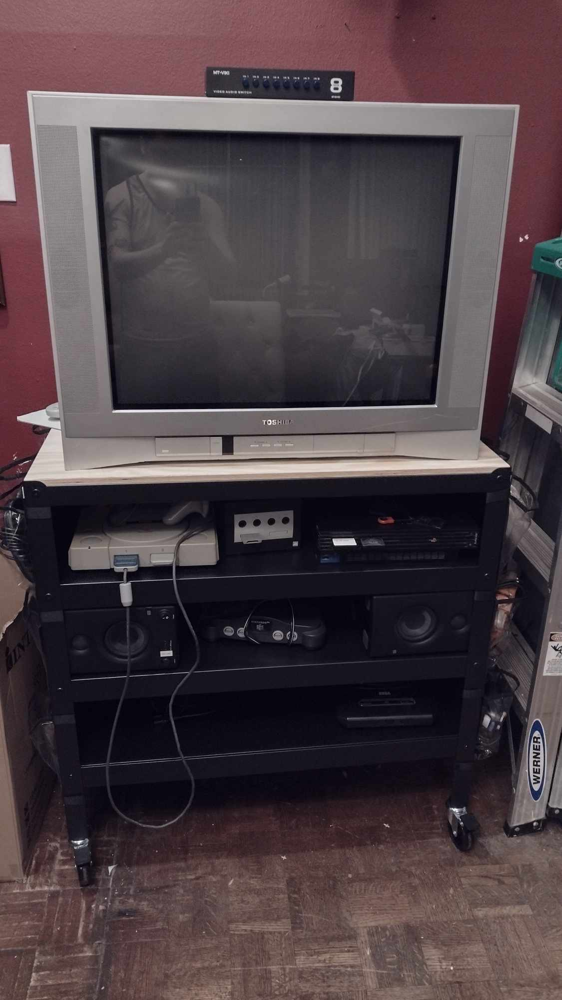
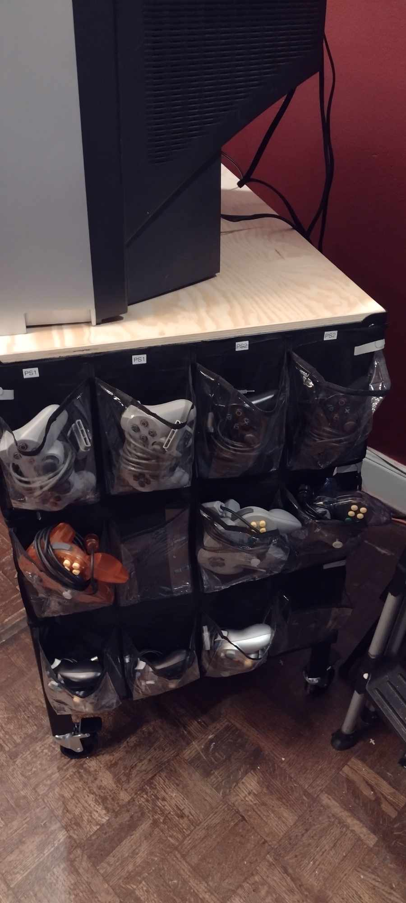

# gertso-to-lazy-to-make-doc
### Retro Gaming Cart Setup

I remember Chris having issues finding a place to put his CRT, and this is the solution I came up with for my setup. The concept of a 'retro cart' isn't new, but I believe my approach is pretty solid and requires only the most basic tools to assemble. Here's how I did it:

- **Base Cart:** I used the rolling cart from IKEA named 'BROR'. This forms the base of the setup.
  
- **Extra Shelf:** I added an extra shelf, also called 'BROR' from IKEA. It's not made for this cart, but the measurements align perfectly. It can be attached with some bolts and washers from any hardware store.
- **Controller Storage:** For storing controllers, I repurposed a cheap door hanging shoe rack, cutting it in half. The dimensions fit perfectly to hang off the sides of the cart. I used double-sided tape and Velcro straps to secure it.
  
- **Power Management:** I installed a very thin and compact 12-outlet power strip on the back of the bottom shelf to manage power for all devices.
- **Video Switching:** On top of the TV, I placed an 8-port composite switch. I tested it thoroughly and noticed no lag or degradation in picture quality. This simple setup works well for everyone I live with, despite not using a component or SCART setup due to budget constraints.
- **Audio:** I opted for Presonus Eris 3.5 speakers, which fit perfectly on the middle shelf and provide excellent sound for retro gaming. They're a great alternative if you prefer not to use TV speakers.

This setup is functional and aesthetically pleasing, making it a great solution for any retro gaming enthusiast looking to organize their gaming space efficiently.

| Item Description                                         | Product                           | Link                                                                                          |
|----------------------------------------------------------|-----------------------------------|-----------------------------------------------------------------------------------------------|
| Rolling cart from IKEA                                   | BROR Utility Cart, Black Pine     | [IKEA BROR Cart](https://www.ikea.com/us/en/p/bror-utility-cart-black-pine-plywood-60333850/) |
| Extra shelf not originally for the cart but fits         | BROR Shelf, Black                 | [IKEA BROR Shelf](https://www.ikea.com/us/en/p/bror-shelf-black-30333842/)                    |
| Controller storage using a modified shoe rack            | Door Hanging Shoe Rack            | [Amazon Shoe Rack](https://www.amazon.com/dp/B0B4JHHSJY?ref=ppx_yo2ov_dt_b_product_details&th=1) |
| Compact power strip for electronics management           | 12 Outlet Power Strip             | [Amazon Power Strip](https://www.amazon.com/dp/B0CS66Q6DY?ref=ppx_yo2ov_dt_b_product_details&th=1) |
| Video switch for connecting multiple devices without lag | 8 Port Composite Switch           | [Amazon Composite Switch](https://www.amazon.com/dp/B0881S1N8C?ref=ppx_yo2ov_dt_b_product_details&th=1) |
| Compact speakers for gaming                              | Presonus Eris 3.5 Speakers        | [Amazon Presonus Eris 3.5](https://www.amazon.com/gp/product/B075QVMBT9/ref=ppx_yo_dt_b_search_asin_title?ie=UTF8&psc=1) |

### disclaimr - not my words but one of a lazy person- so I used AI to organize this BS in 1 min
